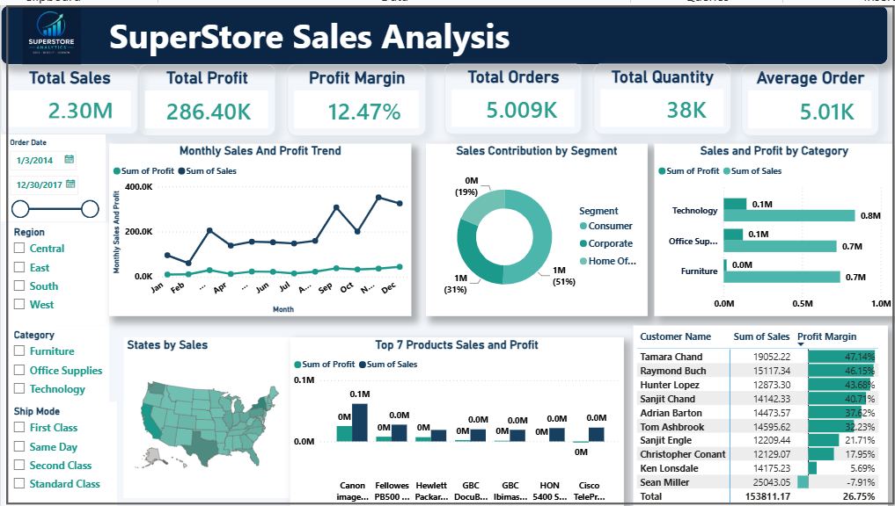
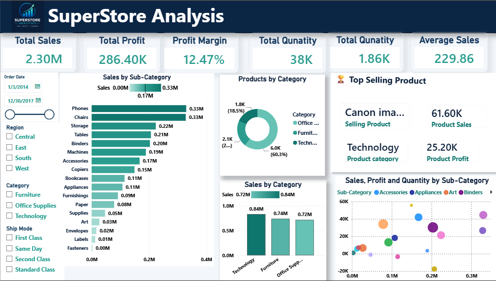
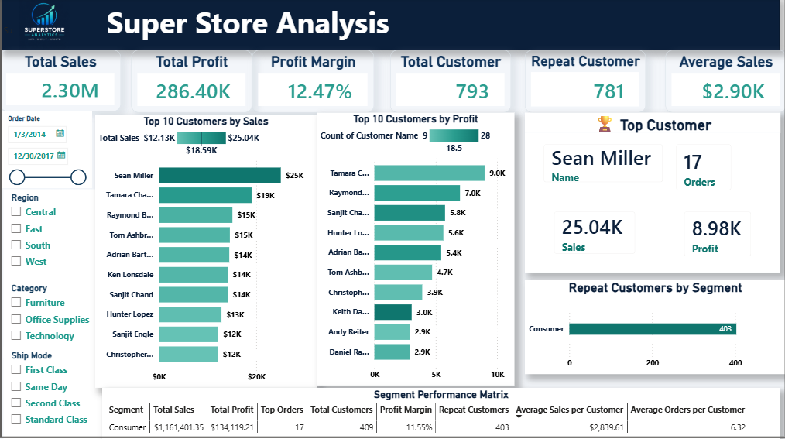
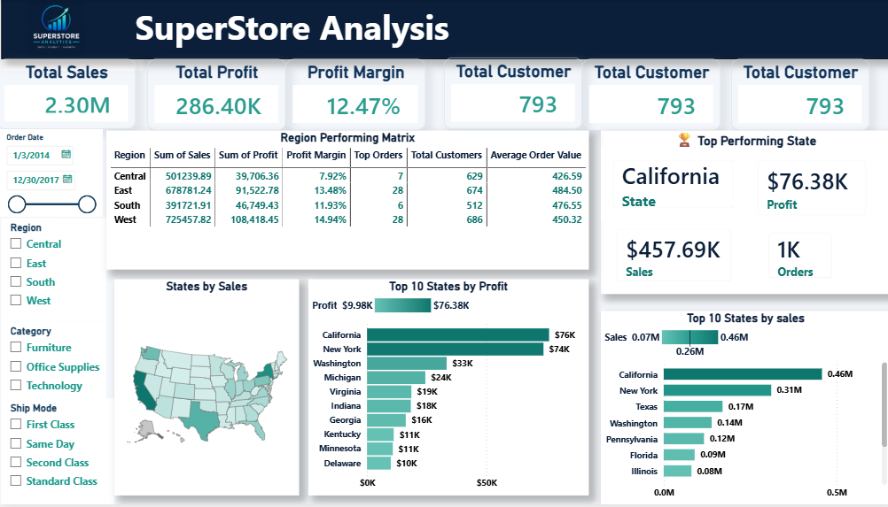

# Power BI SuperStore Sales Analysis

## 📊 Project Overview

This project presents an interactive **SuperStore Sales Analysis Dashboard built using Microsoft Power BI**.

The dashboard analyzes sales, profit, customers, products, categories, segments, and regional performance to identify important business trends and insights.

## 🛠️ Tools & Technologies

* Microsoft Power BI
* Power Query
* DAX
* Data Cleaning & Transformation
* Data Modeling
* Data Visualization
* Business Intelligence

## 📈 Dashboard Pages

### 1. Executive Summary

Provides an overall view of business performance, including:

* Total Sales
* Total Profit
* Profit Margin
* Total Orders
* Total Quantity
* Average Order Value
* Monthly Sales & Profit Trends
* Sales Contribution by Segment
* Sales & Profit by Category
* Sales by State
* Top Products
* Customer Performance

### 2. Product Performance

Analyzes product and sub-category performance, including:

* Sales by Sub-Category
* Products by Category
* Top Selling Products
* Product Sales & Profit
* Sales, Profit and Quantity by Sub-Category

### 3. Customer Insights

Provides insights into customer performance, including:

* Total Customers
* Repeat Customers
* Average Sales
* Top Customers by Sales
* Top Customers by Profit
* Repeat Customers by Segment
* Customer and Segment Performance

### 4. Regional Performance

Analyzes geographical performance, including:

* Regional Sales & Profit
* Profit Margin by Region
* Customers by Region
* Average Order Value
* Top States by Profit
* Top States by Sales
* Top Performing State

## 🔍 Key Insights

* Analyzed overall sales and profitability performance.
* Compared sales and profit across product categories and sub-categories.
* Identified top-performing products and customers.
* Analyzed repeat customer behavior across different segments.
* Compared regional and state-level sales performance.
* Identified high-performing states based on sales and profit.
* Examined monthly sales and profit trends.
* Created interactive filters for Region, Category, Ship Mode, and Date.

## 📷 Dashboard Preview

### Executive Summary

### Product Performance

### Customer Insights

### Regional Performance

## 📁 Project Files

* `SuperStore Sales Analysis.pbix` – Power BI dashboard and analysis file.
* `superstore-executive-summary.png` – Executive Summary dashboard.
* `superstore-product-performance.png` – Product Performance dashboard.
* `superstore-customer-insights.png` – Customer Insights dashboard.
* `superstore-regional-performance.png` – Regional Performance dashboard.

## 🎯 Skills Demonstrated

* Data Cleaning
* Data Transformation
* Data Modeling
* DAX Calculations
* KPI Development
* Dashboard Design
* Data Visualization
* Customer Analysis
* Product Analysis
* Regional Analysis
* Business Intelligence
* Business Insight Generation

## 👩‍💻 Project

**Power BI SuperStore Sales Analysis**

Created using Microsoft Power BI to demonstrate practical skills in data analytics, business intelligence, and interactive dashboard development.
